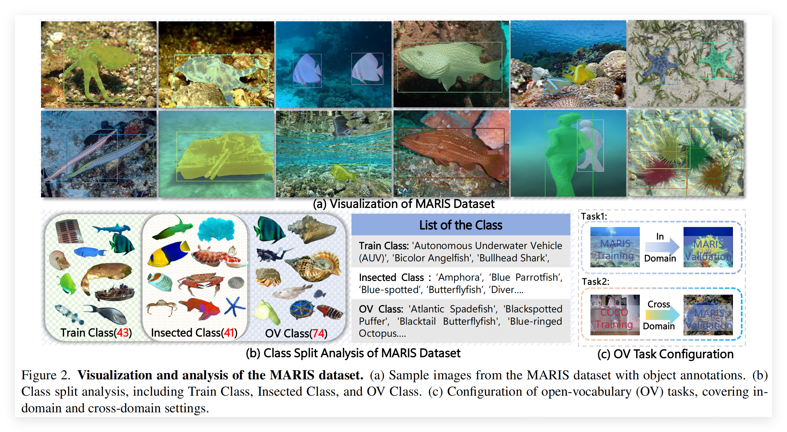
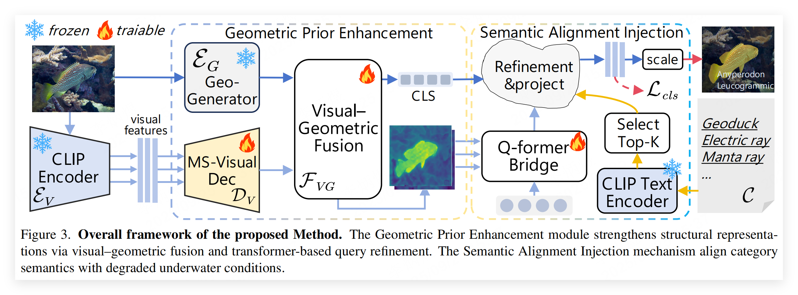
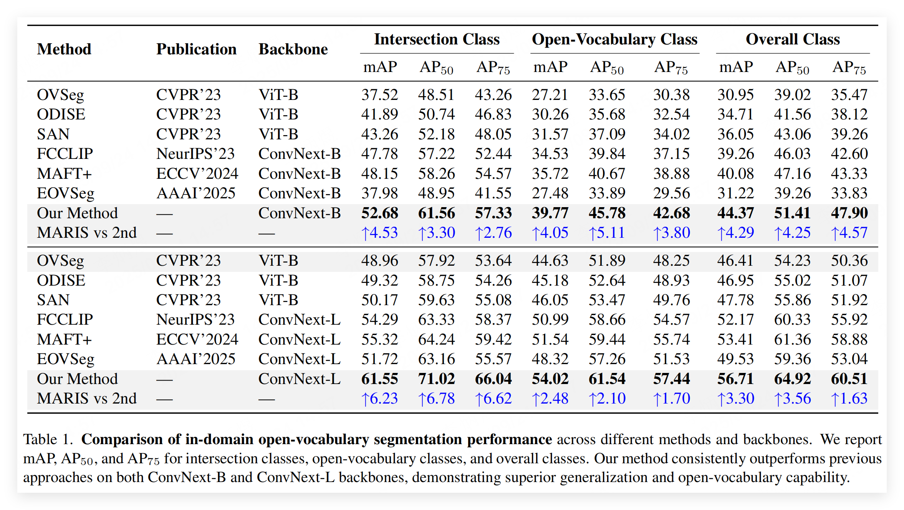
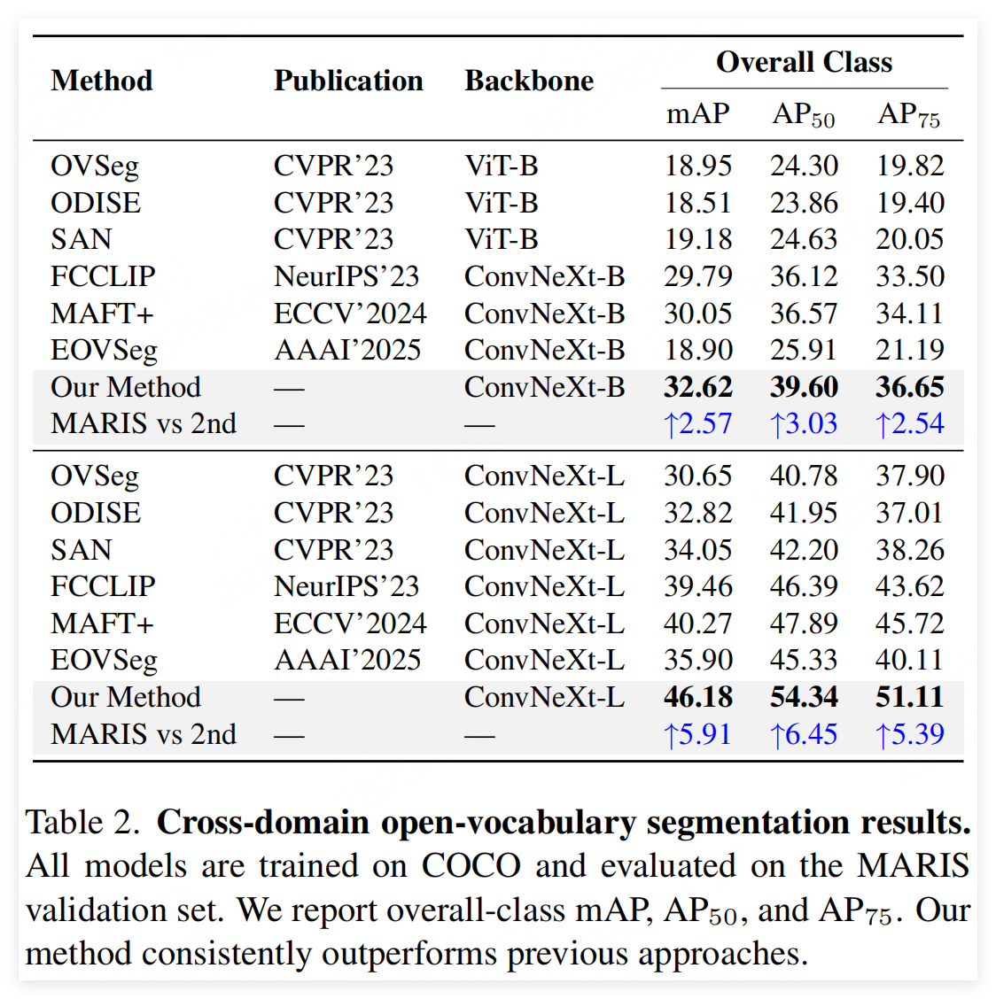

<div align="center">
  
# MARIS: Marine Open-Vocabulary Instance Segmentation with Geometric Enhancement and Semantic Alignment

**The first attempt to Marine Open-Vocabulary Instance Segmentation.**

[Paper](https://arxiv.org/abs/2510.15398) &nbsp;&nbsp;&nbsp;&nbsp; [Open-sourced Datasets](https://pan.baidu.com/s/1XcpDFIWixPj6vxWiHx5DtA?pwd=USTC) &nbsp;&nbsp;&nbsp;&nbsp; [Pretrained Weight](https://pan.baidu.com/s/1FYF5kyrKbDPMboSs7aVzQw?pwd=USTC) 

</div>

> **Note**  
> The author sincerely invites you to contribute to this repository so that we can further improve our open-source work together.  
> If you **encounter any questions or find our any errors**, please feel free to open an issue on GitHub or contact me directly via email at [my email](mailto:libingyu0205@mail.ustc.edu.cn)       (libingyu0205@mail.ustc.edu.cn).

## 🚀 News&Updates​
- [x] 2025/9/124: init repository.

## 🚩 TO DO​
- [ ] release the trained weight.
- [ ] submit the open-sourced dataset in huggingface. (already in Baidu Netdisk [MARIS](https://pan.baidu.com/s/1XcpDFIWixPj6vxWiHx5DtA?pwd=USTC) )


## 🌟 Introduction

Most existing underwater instance segmentation approaches are constrained by close-vocabulary prediction, limiting their ability to recognize novel marine categories. To support evaluation, we introduce **MARIS** (**Mar**ine Open-Vocabulary **I**nstance **S**egmentation), the first large-scale fine-grained benchmark for underwater OV segmentation, featuring a limited set of seen categories and 74 unseen categories. Although open-vocabulary (OV) segmentation has shown promise on natural images, our analysis reveals that transfer to underwater scenes suffers from severe visual degradation (e.g., color attenuation) and semantic misalignment caused by lack of underwater class definitions. To address these issues, we propose a unified framework with two complementary components. The Geometric Prior Enhancement Module (**GPEM**) leverages stable part-level and structural cues to maintain object consistency under degraded visual conditions. The Semantic Alignment Injection Mechanism (**SAIM**) enriches language embeddings with domain-specific priors, mitigating semantic ambiguity and improving recognition of unseen categories.  Experiments show that our framework consistently outperforms existing OV baselines on MARIS, establishing a strong foundation for future underwater perception research.

## 🌟 New Task & Dataset


MARIS is a new task for underwater instance segmentation.

## 🌟 New Architecture

we propose a unified framework with two complementary components for underwater open-vocabulary instance segmentation.

## 🌟 Great Results


Our framework consistently outperforms existing OV baselines on MARIS. 

## Installation
See [installation instructions](INSTALL.md).

## Getting Started
See [Getting Started with  MARIS](GETTING_STARTED.md).

## <a name="Citing MARIS"></a>Citing  MARIS

If you use MARIS in your research, please use the following BibTeX entry.

```BibTeX

```

## Acknowledgement
We sincerely appreciate the invaluable contributions of numerous open-source projects and datasets that have supported our work, including but not limited to [Mask2Former](https://github.com/facebookresearch/Mask2Former), [FCCLIP](https://github.com/bytedance/fc-clip), [ODISE](https://github.com/NVlabs/ODISE).
